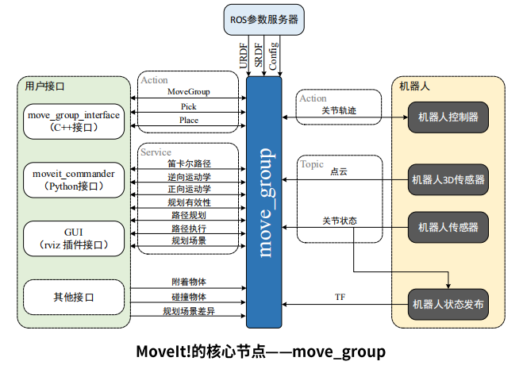
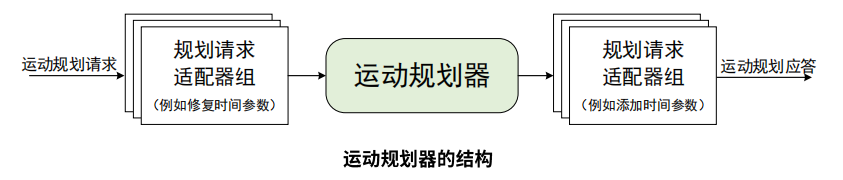

# 智德宜居服务机器人开发日志
***
## 2018.12.27  燕山大学
### 完成：
#### 1、建立了github仓库，在windows端通过git向github上传文件。
### git参考教程
 * [廖雪峰官方网站](https://www.liaoxuefeng.com/wiki/0013739516305929606dd18361248578c67b8067c8c017b000)
 * [git](http://www.runoob.com/w3cnote/git-guide.html)简明教程
 * [git](https://github.com/phodal/github)漫游指南
 * [git](http://www.cnblogs.com/mike-mei/p/8013035.html)教程
 * [Markdown](https://blog.csdn.net/u014061630/article/details/81359144#00)教程
 ***
## 2018.12.28 燕山大学
***
### 技术：机器人包含的技术可分为机械、电子和软件。
### 电子：
   电子的作用是控制执行机构，电子部分作为连接硬的重要组成部分，主要的任务是负责将软件传过来的数据进行解析，并且以最快的速度传递给接有驱动盒的电机来实时地控制执行机构。同样，通过电机编码器返回的数据通过硬件发送给上位软件。
### 软件：软件可分为移动机器人本体的导航和机械臂的运动规划。
* [ROS](http://wiki.ros.org/cn)中移动机器人导航框架图：

* 了解一个功能包首先看它的**输入**、**输入**和提供我们的**话题**、**服务**。
* 上图可知move_base最终给我们的是机器人的cmd_vel话题，cmd_vel包括机器人的**线速度**和**角速度**。
* 白色的节点表示move_base已经替我们做好的，灰色的节点表示**可选的**，可要可不要，蓝色的节点是move_base要求的**输入**。
***
## 2018.12.29 燕山大学
### 机械臂的运动规划
* 运动规划在机械臂的自主抓取中扮演了非常重要的角色。而对于运动规划本身来说，里面涉及了非常多的专业知识，设计机械臂的**运动学正逆解**、**碰撞检测算法**、**3D环境感知**、**动作规划算法等**，任何一个方面都需要很长时间才能理解。

* ROS提供了强大且易用的**MoveIt**包，可以让初学者在较短的时间内实现仿真乃至实体机械臂的运动学规划演示
* **MoveIt**的总体框架

   从图中可以看到，move_group是MoveIt!最核心的部分。它将其它独立的组件集成到一起，为使用者提供了一系列可以使用的命令和服务。

* **用户接口：**    
                                                                                                                                                                                                                                                                                                 
  上图左侧是人机交互界面，ROS提供给开发者得有GUI界面、C++、python。
  
  * C++:使用move_group_interface包提供的API。
  * python:使用moveit_commander包提供的API。
  * GUI:使用moveit的RVIZ插件。
* **配置：**

   **move_group**本质上还是一个ROS的**节点**，它需要使用ROS的参数服务器来获取以下三种信息。
   * URDF：
   
     **move_group**需要机械臂的URDF文件来进行运动规划。
   * SRDF：
   
     **move_group**在启动时会寻找机械臂的SRDF文件，它可以通过使用MoveIt! Setup Assistant自动生成。
   * MoveIt配置：
   
     **move_group**在启动时会加载机械臂的关节限位、动力学、运动规划、感知以及其他相关信息。所有以上的配置信息都可以通过使用MoveIt! Setup Assistant自动生成。
* **机器人接口：**

   **move_group**使用ROS中的**Topic**和**Action**两种机制来与机械臂进行数据通信。它可以获取当前机械臂的**位置**信息，**点云数据**以及其他传感器数据，并且发送命令给机械臂的Controller。
   * 关节状态信息：
   
     **move_group**通过监听机械臂的/joint_states主题来获取当前的状态信息。move_group只负责监听，需要给机械臂配置好**Joint State Controller**。
   * 坐标转换信息：
   
     **move_group**通过订阅机械臂的TF主题来确定机械臂内部各关节之间的位置变换关系。跟上面一样，需要运行**Robot State Publier**节点来发布坐标转换。
* **控制器接口：**

    **move_group**使用**Follow Joint Trajectory**类型的**Action**接口来与控制器（Controller）进行数据通信。
	
    **move_group**是不带Action接口的，它是使用了一个特殊的插件来发布上述Follow Joint Trajectory类型的Action，而对于机械臂来说，你依然需要自己配置上述类型的Controller来订阅机械臂的数据。   
* **规划场景：**

   Planning Scene指的是机械臂本身以及其周围环境的表示。
* **扩展能力：**

   **move_group**的所有组件都是以独立插件的形式实现的，而且这些插件可以通过使用ROS的参数文件或插件库来进行配置，这使得move_group拥有了强大的定制以及可扩展能力。 
 
## 2018.12.30 燕山大学 
### **Motion Planning**

  * 古月居前辈对运动规划的解释：
  
    假设我们已知机器人的**初始姿态**和**目标姿态**，以及机器人和环境的模型参数，那么我们就可以通过一定的算法，在躲避环境障碍物和放置自身碰撞的同时，找到一条到达目标姿态的较优路径，这种算法就称为机器人的运动规划。机器人和环境的模型静态参数由URDF文件提供，在实际场景下还需要加入3D摄像头、激光雷达来动态检测环境变化，避免与动态障碍物发生碰撞。

    在moveIt!中，运动规划算法是由运动规划器算出来的。运动规划算法有很多，每一个运动规划器都是MoveIt的一个插件，可以根据需求选用不同的规划算法。MoveIt!默认使用的是[OMPL](http://ompl.kavrakilab.org/)。OMPL(Open Motion Planning Library)是开源运动规划库的简写，它提供基于随机化的运动规划器。

* 运动规划请求：
     在让运动规划器进行运动规划之前，我们要先发送一个运动规划的请求。这个请求可以是新的机械臂或末端执行器的位置。为了让运动规划器规划出来的轨迹符合要求，我们需要指定一些约束条件：
   * 位置约束：       约束机械臂Link的位置。
   * 方向约束：       约束机械臂Link的方向。
   * 可见性约束：     约束Link上的某点在某些区域的可见性。
   * 关节约束：       约束Joint的运动范围。
   * 用户自定义约束： 用户通过回调函数自定义约束的条件。
   
* 运动规划结果：   
     move_group节点最终将会根据上面的运动规划请求，生成一条运动轨迹。这条轨迹可以使机械臂移动到预想的目标位置。move_group最终输出的是一条**轨迹**，而不是**路径**。对于机械臂来说，路径是使末端执行器移动到目标位置的过程中，中间所经历的**一系列独立的位置点**。而轨迹则是在路径的基础上，通过加入速度、加速度约束以及时间参数来使机械臂运动的更加平滑。

 
## 2018.12.31 燕山大学

### 规划请求适配器：

   在运动规划器的输入输出端分别有两个规划请求适配器。它们的作用分别是对规划请求和规划结果进行预处理和后期处理。MoveIt!提供了几种默认的适配器来完成一些特定的功能。
   * FixStartStateBounds:
   
      当机械臂的一个或多个关节的初始状态稍微超出了URDF文件中所定义的Joint Limits后，为了能让运动规划器可以运行，FixStartStateBounds适配器会通过将关节状态移动到Joint Limits处来解决这个问题。不过，如果机械臂关节的偏差很大的话，这种靠软件方式修正的方式就不适用了。
   * FixWorkspaceBounds：
   
      设置一个默认尺寸的工作空间。
   * FixStartStateCollision:

      如果已有的关节配置文件会导致碰撞，这个适配器可以采样新的配置文件，并根据摇摆因子来修改已有的配置文件，从而保证新的机械臂不会发生碰撞。
   * FixStartStatePathConstraints:

      如果机械臂的初始姿态不满足路径约束，这个适配器可以找到附近满足约束的姿态作为机械臂的初始姿态。
   * AddTimeParameterization:

      它把从运动规划器中输出的空间路径按等距离进行划分，为每个轨迹点添加加速度、加速度约束，以及时间戳等必要信息。   
 * 场景规划
 
 
 
 **Planning Scene**用来表示机械臂周围的外部世界并且保存机械臂自己本身的状态。它通过监听对应的**Topic**来获取关节状态(joint_states)信息、传感器信息。并可以根据传感器信息和用户的输入，生成机器人周围的环境信息。